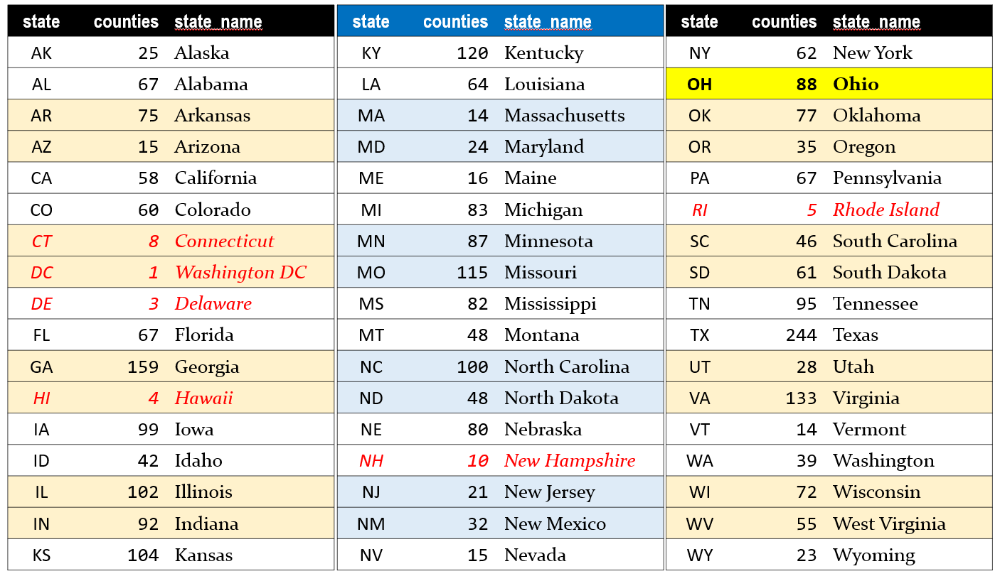

This page was last updated: `r Sys.time()`.

```{r setup, include=FALSE}
knitr::opts_chunk$set(comment = NA)
```

# What Data Will I Use?

The data set for Project A is now available. The data are the 2020 version of the analytic data from County Health Rankings. In much of what follows, we will abbreviate County Health Rankings as **CHR**.

The data are gathered at [the County Health Rankings Data & Documentation site](https://www.countyhealthrankings.org/explore-health-rankings/rankings-data-documentation).

The key links for you are provided as part of the National Data & Documentation section of that site for the **2020 County Health Rankings**. Do not use data from previous editions of the CHR, and do not use the trends data available on their website for this project. 

Specifically, you'll need three files:

- [the 2020 CHR CSV Analytic Data](https://www.countyhealthrankings.org/sites/default/files/media/document/analytic_data2020_0.csv) (a .csv file)
- [the 2020 CHR Analytic Data Documentation](https://www.countyhealthrankings.org/sites/default/files/media/document/2020%20Analytic%20Documentation_0.pdf) file (PDF), and
- [the 2020 Data Dictionary](https://www.countyhealthrankings.org/sites/default/files/media/document/DataDictionary_2020_2.pdf) (PDF)

These files are also available in the [data folder for Project A](https://github.com/THOMASELOVE/431-2020/blob/master/projects/projectA/data/README.md) on Github, and in the Google Drive folder Dr. Love has shared with you. 

# Developing the Data: Overview

Cleaning the data will be a time-consuming effort, but the good news is that you can begin it immediately. Before you complete any of the required analyses in R, you'll need to complete the following steps.

1. Ingest the data into R after removing the top row from the .csv outside of R.
2. Select variables (at this stage, there will be 3 required variables, plus 5 additional variables you select, for a total of 8) that you actually need to use and rename them into useful formats instead of the default names provided by CHR. Save the result in your analytic tibble, which should be called **chr_2020**.
3. Filter your **chr_2020** file so that it contains only the subset of observations (counties) that you actually want to study. Note that each of these counties will have to have a `county_ranked` value of 1. You will be working with a subset of the available `state`s, which should include the 88 counties of Ohio, plus counties from 3-5 other states you will select.  
4. Make some transformations to obtain categorical versions (factors) of two of your selected variables and add them to your **chr_2020** tibble. Retain the original versions of those two variables, too, so that you wind up with 10 variables in total.
5. Your final **chr_2020** tibble will therefore contain 200-400 rows (counties) and 10 variables. Eventually, you'll save this tibble as an R data frame.

# Data Development Task List

Here are some of the necessary details for each step of this process. Please refer to Dr. Love's materials in the Project A [Examples](examples.html) section for more help.

## Task A. **Ingest the CHR Data into a tibble**

1. Remove the first row of the available `.csv` file to leave the second row as the top row before ingesting the data into R (I suggest you do this in Excel or perhaps Google Sheets, and then resave a new version of the file without this top row as a .csv before ingesting into R)

2. Read the resulting `.csv` file into R, and call the resulting tibble **chr_raw**. Be sure that this goes as smoothly as possible.

## Task B. **Identify a set of 4-6 states, containing 200-400 counties.** 

Your selection must include: 

- the 88 counties of Ohio, and 
- all of the counties in a subset of 3-5 additional states in the US

The number of counties associated with each state (specified using its two-letter postal abbreviation code) is listed below, for your convenience. 

- Do not include any state (including the District of Columbia, Connecticut, Delaware, Hawaii, New Hampshire and Rhode Island) with fewer than 12 counties. Those entities are shown in red below.



So, including `OH`, you will need a total of 200-400 counties, from 4-6 states. For example,

- one possible combination would be the states of `TX` (244 counties), `AZ` (15 counties) and `NM` (32 counties) in addition to `OH` (88 counties), which would yield 379 counties in 4 states
- another combination would be the states of `WA` (39 counties), `WI` (72 counties), `WV` (55 counties) and `WY` (23 counties) to join `OH` (88 counties) yielding 277 counties in 5 states
- and yet another would be `PA` (67), `NY` (62), `NJ` (21), `MD` (24) and `VA` (133) in addition to `OH` (88) yielding 395 counties in 6 states

### Notes

1. You can choose your subset of states in any way you like, keeping in mind that some variables in the CHR data are not available for some counties, and that each state you select should have more than 12 counties. 
2. You should have some reason for selecting the states that you do, and you will need to describe that reason in a complete sentence or two in your proposal and your final report.

## Task C. **Identify Your Variables**

Here you will need to identify variables from the data for your selected sample of counties that will allow you to create a tibble that includes:

- the five-digit fips code for the county, which will be a convenient ID variable
- the name of the county, which will be useful for labeling and identifying the counties 
- the `state`, which will be a multi-categorical (with 4-6 categories) variable
- and a total of five variables selected from the 107 variables in the CHR data set that are listed as `vXXX_rawvalue` (note: to select the entire group of 107 variables, you might try `select(ends_with("rawvalue"))` as part of a pipe of the data.)

### The 107 variables you must select 5 from

The [2020 CHR Analytic Data Documentation](https://www.countyhealthrankings.org/sites/default/files/media/document/2020%20Analytic%20Documentation_0.pdf), and [2020 Data Dictionary](https://www.countyhealthrankings.org/sites/default/files/media/document/DataDictionary_2020_2.pdf) PDF files are crucial here, as those are the ones that explain what the available variables mean, and how they should be labeled. 

You must select your five variables from these 107 variables in the raw (.csv) data file. We show them here in the order in which they appear in the raw file. The listing "v001" in this table actually refers to the variable named "**v001_rawvalue**".


"v001", "v002", "v036", "v042", "v037", "v009", "v011", "v133", "v070", "v132", 
"v049", "v134", "v045", "v014", "v085", "v004", "v088", "v062", "v005", "v050", 
"v155", "v021", "v069", "v023", "v024", "v044", "v082", "v140", "v043", "v135", 
"v125", "v124", "v136", "v067", "v137", "v147", "v127", "v128", "v129", "v144", 
"v145", "v060", "v061", "v139", "v083", "v138", "v039", "v143", "v003", "v122", 
"v131", "v149", "v159", "v160", "v063", "v065", "v141", "v142", "v015", "v161", 
"v148", "v158", "v156", "v153", "v154", "v051", "v052", "v053", "v054", "v055", 
"v081", "v080", "v056", "v126", "v059", "v057", "v058", "v104", "v099", "v100", 
"v101", "v010", "v150", "v109", "v018", "v019", "v103", "v116", "v117", "v118", 
"v120", "v119", "v106", "v105", "v107", "v123", "v008", "v013", "v016", "v017", 
"v025", "v026", "v027", "v031", "v032", "v035", "v097"

For example, `v001_rawvalue` shows the raw values for the premature death measure. If you select this variable, it is up to you to use the documentation in the two PDF files I have linked to, as well as the information on the County Health Rankings website, to get a reasonable understanding of what the variable measures, and how it was collected.

### Notes

1. As mentioned above, your five variables must be five different variables selected from the 107 variables in the CHR data set that are listed as `vXXX_rawvalue`. Some of the variables in that set of 107 are better choices than others: not all of them will meet our specifications.

2. Each of the five variables you select must have data for at least 75% of the counties in each state you plan to study. This is something you will have to check on, in R, and you'll have to present the code, and demonstrate with complete English sentences that you've verified this to be true for your selections.

3. Each of the five variables you select must be of some actual interest on its own, in terms of providing useful information about a feature of the county that might relate to the health outcomes you are studying.

4. Across your complete set of 4-6 selected states, the raw versions of each of your five selected variables must have at least 10 distinct non-missing values. Again, you'll need to show R code to do this checking, and demonstrate with complete English sentences that you have checked this to be true.

## Task D. **Create Categorical Variables**

Your five selected quantitative variables, selected by you from the 107 available "raw value" CHR variables, will need be treated as follows:

- variable 1 will be treated as quantitative, and as an outcome of interest
- two others (variables 2 and 3) will also be treated as quantitative predictors of interest for variable 1
- variable 4 will be categorized into 2 mutually exclusive and collectively exhaustive levels to create a binary categorical variable of interest in predicting variable 1 (this is a terrible idea in practical work)
- variable 5 will be categorized into 3-5 mutually exclusive and collectively exhaustive levels to create a multi-categorical variable of interest in predicting variable 1 (this is almost as bad as what we'll do to variable 4 in practical work)
- the `state` will serve as another multi-categorical (with 4-6 categories) predictor of variable 1, so this will also be part of your tibble

## Task E. **Create your Main Tibble**

In your R Markdown file, you will need to present all code necessary to take the original .csv data file (with the top row removed outside of R) and wind up with your `csv_2020` tibble so that we can run that code and get the same results you do.

Your main data set for analysis then should be gathered into a tibble called **chr_2020** containing the following information:

- the identifying variables for each county, specifically:
    - `fipscode` = the five-digit fips code for the state and county,
    - `county` = the name of the county
    - `state` = the postal abbreviation code for the state
- your three selected quantitative variables
- your binary categorical variable derived from your fourth selected variable
- your multi-categorical variable derived from your fifth selected variable
- the "original" quantitative versions of the two variables (4 and 5) that you later categorized

All of these variables should be renamed (and also have clean_names applied) so as to have descriptive and maximally helpful variable names. 

- For example, if you have decided to use as a quantitative variable something like  `v009_rawvalue`, which is about adult smoking, you should rename the variable `v009_rawvalue` to **adult_smoking** in your tibble. 
- If `v009_rawvalue` (about adult smoking) is to be one of your categorical variables, then you should include both the original quantitative value (renamed `adult_smoking_raw`) and your categorical variable that you'll actually use in analyses, and which is named `adult_smoking_cat`.

### Notes

1. After your cleaning is done, each row in your `chr_2020` tibble should contain all of the counties within the 4-6 states you are studying, and no other counties should be included in your tibble. 
2. If data for some counties are missing in the raw data for one or more of your variables, then these data should be indicated as missing (using NA) in the tibble.
3. There is no need to set a seed in this process, as you are not doing anything that involves selecting a random sample.

## Task F. **Provide a Codebook for Your Tibble**

Next, you will provide a codebook as part of your R Markdown file (and HTML/PDF output) that specifies the name of each variable in your tibble and its definition. 

### Notes

1. Use the [2020 CHR Analytic Data Documentation](https://www.countyhealthrankings.org/sites/default/files/media/document/2020%20Analytic%20Documentation_0.pdf) to guide your description of the variables you've chosen. 

2. The [2020 Data Dictionary](https://www.countyhealthrankings.org/sites/default/files/media/document/DataDictionary_2020_2.pdf) provides information on each variable, but you will want to write more than it provides for your key variables, using the [Data Documentation](https://www.countyhealthrankings.org/sites/default/files/media/document/2020%20Analytic%20Documentation_0.pdf) to indicate the roles of your chosen variables in the health rankings, and provide context.

3. Be sure to include a description for each of the 10 variables in your final tibble, not just the ones that you wind up using in your analyses.

4. Include a description of what the cutpoints are for the two categorical variables you create, and specify how those cutpoints were chosen. 

## Task G. **Saving and Summarizing Your Tibble**

1. **Save the Tibble**: You should provide code that saves your tibble as an R data set into your R Project, with the file name **chr_2020_YOURNAME.Rds**. If you like, you can store this `.Rds` file in a `data` subdirectory within your R Project.

2. **Print the Tibble**: You will then prove that your tibble is in fact a tibble and not just a data frame by listing it, so that the first 10 rows are printed, and the columns are appropriately labeled. 

3. **Numerical Summaries**: You will then demonstrate main numerical summaries from the tibble by running the following summaries.

- `Hmisc::describe` on the whole tibble (all 10 variables: which is what you'll do for the proposal).
- In the project report, there are two additional requirements. 
    - `mosaic::favstats` on each of your quantitative variables (so variables 1, 2, and 3 and the original versions of variables 4 and 5)
    - `janitor::tabyl` on your categorical variables 4 and 5 as well as on `state`.

